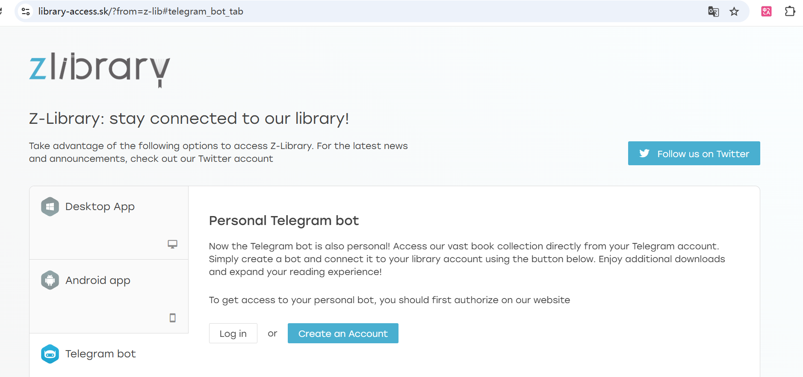

>Z-Library（简称 Z-Lib）是一个全球最大的影子图书馆（shadow library），成立于2009年，提供免费下载数千万本电子书（超过1500万册）和学术文章（超过8500万篇），覆盖文学、学术、科技等多领域。

# 一.哪些渠道可以使用zlibrary
总结如下:
1. 网页版
2. 客户端版本(在网页版有提供下载)
3. telegram的机器人

* zlibrary的访问需要挂梯子
* zlibrary每天提供10次免费下载额度(绰绰有余了)
* 下载好的文件, 可以导入到微信读书进行阅读
# 二.如何获取网址
https://z-library.sk/s/Elementary%20Linear%20Algebra%20Applications
(截止到2025-12-20有效)

如果过期了, 可以在`Reddit`的zlibrary社区搜寻:https://www.reddit.com/r/zlibrary/

# 三.如何构建telegram Bot
https://www.reddit.com/r/zlibrary/comments/z5pe1k/how_to_connect_zlibrary_account_to_telegram_bot/?tl=zh-hans

